<p align="center">
  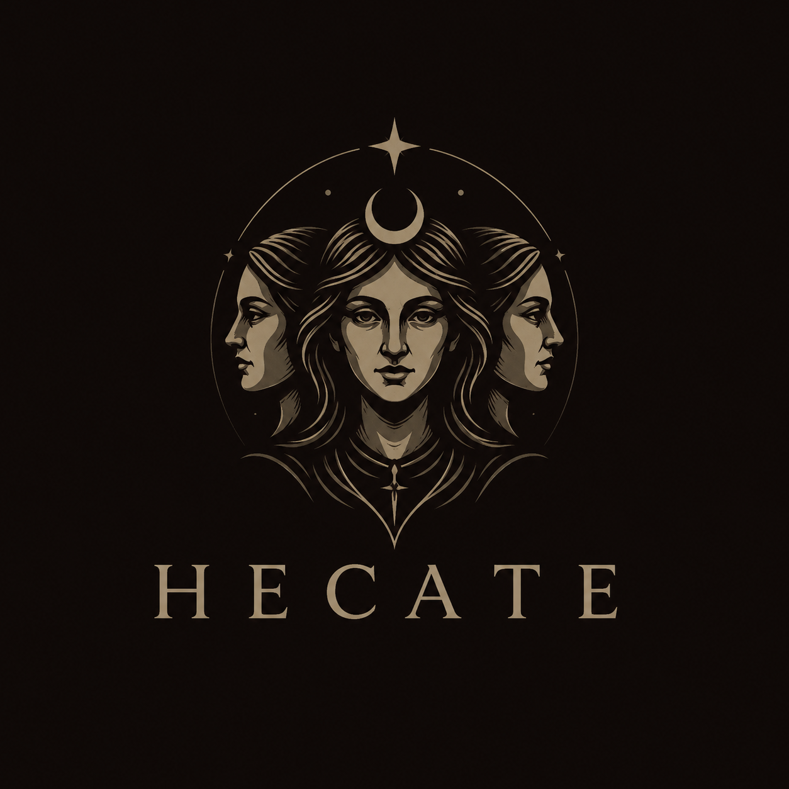
</p>

<h1 align="center">Hecate</h1>

<p align="center">
  <strong>Custom WhisperGate-themed web UI for <a href="https://github.com/its-a-feature/Mythic">Mythic C2</a> (v3)</strong>
  <br/>
  <em>Status: public beta — <code>v0.1.0</code></em>
</p>

Crimson-black operator interface replacing Mythic's built-in React UI. Talks directly to Mythic's existing GraphQL / WebSocket API — no Mythic modifications required.

> ⚠️ **Beta software.** Tested against Mythic v3.x in lab environments. Type-check is currently the only automated correctness gate (no test suite yet). Expect rough edges; please file issues with reproduction steps.

<p align="center">
  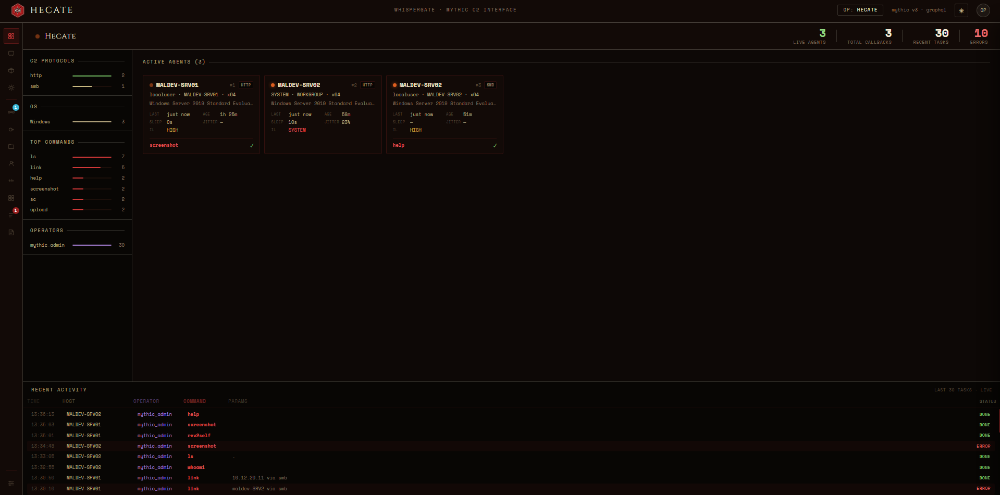
</p>

---

## Stack

| Layer | Choice |
|---|---|
| Framework | React 18 + Vite |
| Styling | Vanilla CSS Modules + custom design tokens (dark + light themes) |
| GraphQL | Apollo Client 3 |
| Real-time | GraphQL Subscriptions over WebSocket (`graphql-ws`) |
| State | Zustand |
| Serve (prod) | nginx (Docker) — HTTPS only, self-signed cert auto-generated |

---

## Prerequisites

- A running Mythic instance (v3.x)
- Docker + Docker Compose

---

## Running

Hecate runs inside Docker and joins Mythic's network directly — no host bridging required. Browser-facing nginx serves HTTPS only; a self-signed certificate is generated on first start and persisted in a named volume so subsequent rebuilds reuse it.

```bash
# Verify Mythic's network exists first
docker network ls | grep mythic   # should show mythic_default

# Build and start
docker compose up -d --build
# → https://localhost:3100   (self-signed cert — browser warning expected once)
```

### Configuration

| Variable | Default | Purpose |
|---|---|---|
| `HECATE_PORT` | `3100` | Host port mapped to the container's `:443`. Set in env or `.env` file. |
| `MYTHIC_HOST` (build arg) | `localhost:7443` | Address of Mythic when Hecate is on a different machine. |

```bash
# Custom host port — three equivalent options:

# 1. Inline env var
HECATE_PORT=8443 docker compose up -d --build

# 2. .env file in the repo root (auto-loaded by docker compose)
echo "HECATE_PORT=8443" > .env
docker compose up -d --build

# 3. Edit docker-compose.yml directly
#    ports:
#      - "8443:443"

# Remote Mythic
docker build --build-arg MYTHIC_HOST=10.10.0.5:7443 -t hecate .
```

The container always listens on `:443` internally; only the host-side mapping changes.

### Bringing your own certificate

The container expects a cert + key at `/etc/nginx/ssl/hecate.{crt,key}`. The `hecate-ssl` named volume holds the auto-generated self-signed pair. To replace with your own (e.g. a real cert for remote deployments):

```bash
# Copy your cert/key into the named volume
docker cp mycert.crt hecate:/etc/nginx/ssl/hecate.crt
docker cp mycert.key hecate:/etc/nginx/ssl/hecate.key
docker compose restart hecate
```

Or bind-mount a host directory in `docker-compose.yml` instead of using the named volume.

---

## Tour

### Callback view & tasking
Live callback list, multi-select tasking, command bar with tab-completion, snippet library (`Ctrl+P`), split-pane or terminal-console output, `ls` → file browser, `ps` → process browser with inject/kill.

<p align="center">
  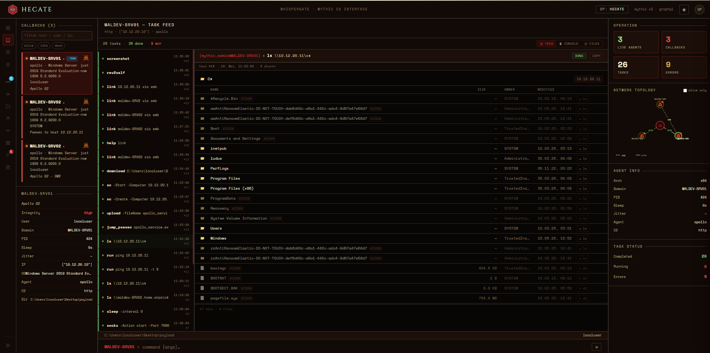
</p>

### Pivot graph
Animated SOCKS traffic, P2P parent→child edges (SMB / TCP / WebSocket / DNS), broken lines for dead agents, per-host badges for live tunnels.

<p align="center">
  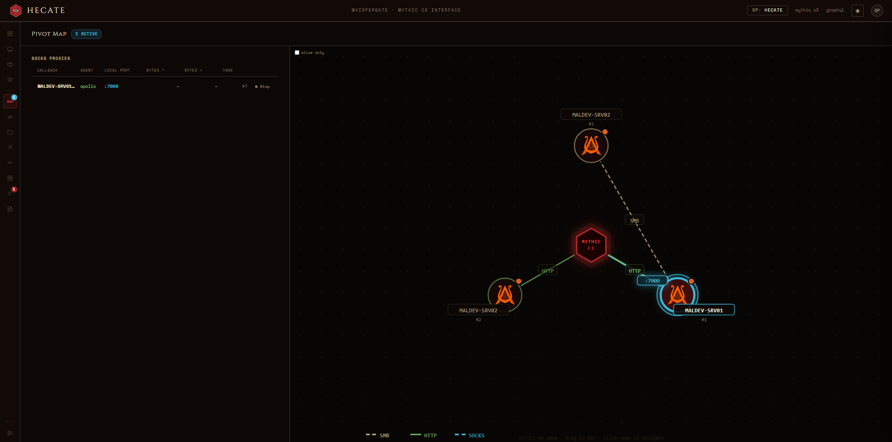
</p>

### MITRE ATT&CK matrix
Per-tactic coverage overlays (command-defined vs tasks actually run vs both). Export as ATT&CK Navigator JSON layer.

<p align="center">
  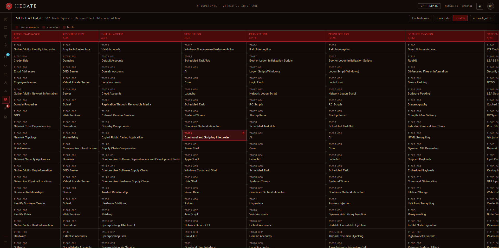
</p>

### Timeline
Horizontal swimlane of every task across every callback. Zoom 1× – 8×. Click any event for the detail bar.

<p align="center">
  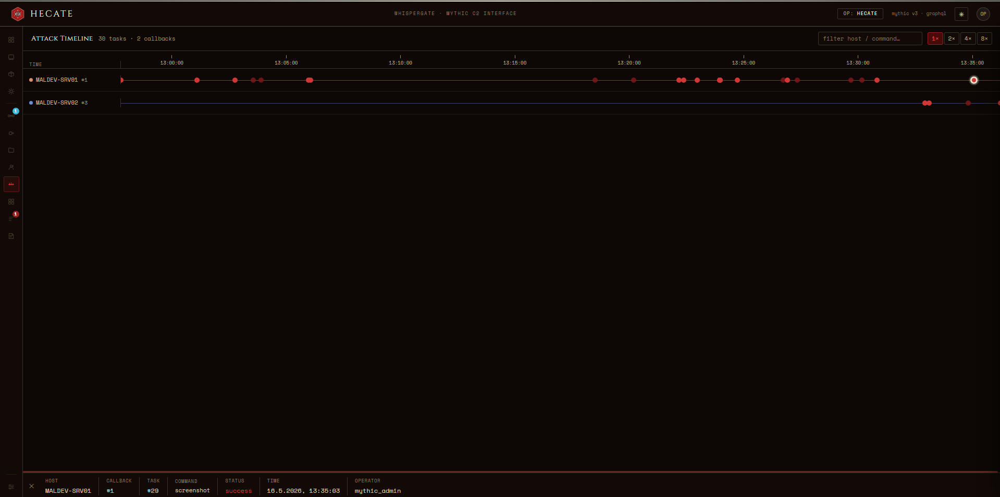
</p>

### Payload manager
Full build / list / soft-delete with C2 parameter configuration, file-param uploads, wrapper payload selection.

<p align="center">
  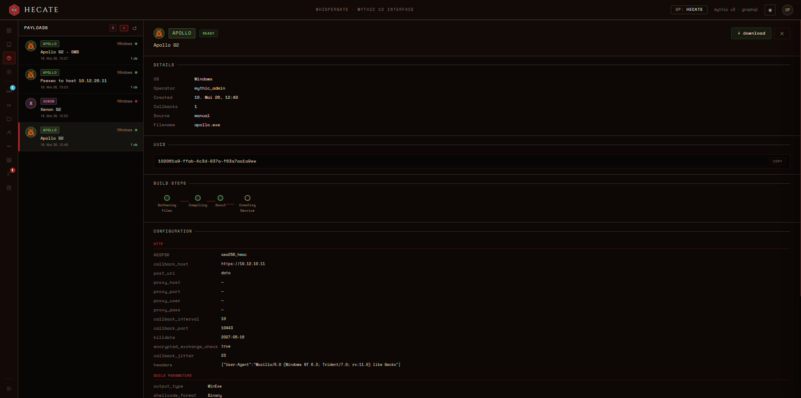
</p>

### Report
TTP-attributed task summary, sourced from `attacktask` + `attackcommand`. Per-callback include/exclude filter.

<p align="center">
  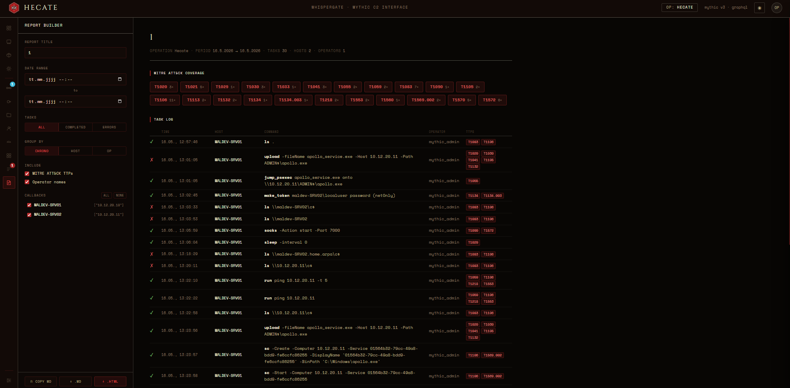
</p>

### Operation event log
Live operator log with warning resolution + filtering.

<p align="center">
  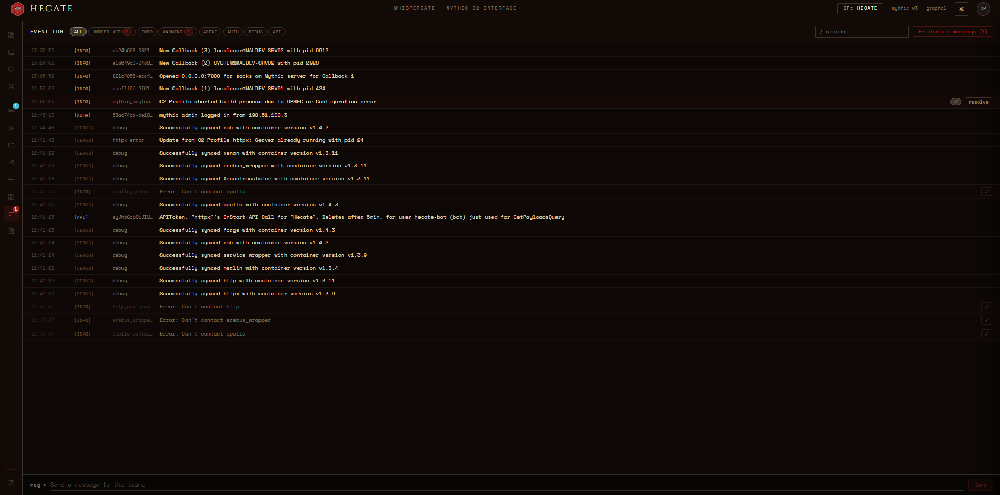
</p>

### Operations & services
Switch active operation, view registered C2 / payload type containers.

<p align="center">
  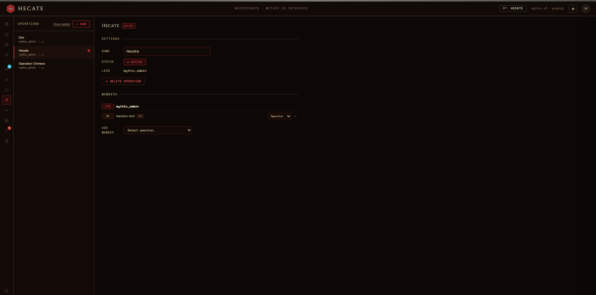
  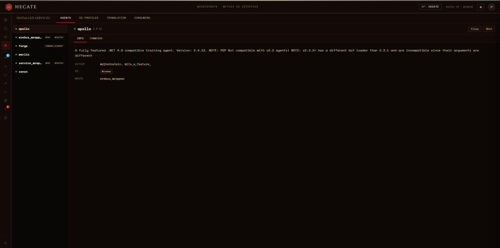
</p>

---

## Features

### Callback management
- Live callback list with alive / idle / dead status, sleep-aware check-in detection
- Per-callback annotations (color + freetext) persisted per operation
- Multi-select for batched tasking across callbacks (Ctrl/Cmd-click)
- Filter by status, agent type, search

### Tasking
- Command bar with tab completion, per-callback history (↑/↓), context status bar (CWD, impersonation token)
- **Snippets** — save reusable commands, recall via `Ctrl+P` or the `≡` button
- Modal pickers for file uploads, credentials, multi-group params, SOCKS, reverse port-forwards, P2P link / unlink

### Output rendering
- Split-pane feed view or oldest-first console view
- `ls` output → interactive file browser with download links and path navigation
- Apollo `ps` output → sortable / filterable process table with inject + kill actions

### Visualisation
- Network topology SVG with protocol-aware edges (HTTP / SMB / TCP / WebSocket / DNS), broken lines for dead agents
- Full pivot graph panel — animated SOCKS traffic, P2P parent / child routing, host labels
- Horizontal timeline of all tasks across callbacks (zoom 1× – 8×)
- MITRE ATT&CK matrix with command-coverage / task-coverage overlays; export as Navigator JSON layer

### Operations
- Payload manager — build, list, soft-delete, full C2 parameter configuration, file-param uploads
- Files panel — categorised downloads / uploads / screenshots with text-file inspector
- Credentials panel
- Operation event log with warning resolution
- Services panel — registered C2 profile / payload type containers
- Operations panel — switch active operation
- Report panel — TTP-attributed task summary, sourced from `attacktask` + `attackcommand`

### Theming
- Dark (WhisperGate crimson-on-black, default) and light (warm parchment) themes

---

## Project structure

```
src/
├── apollo/
│   ├── client.ts          Apollo setup, lazy WS link, login / logout
│   └── operations.ts      All GQL queries, mutations, subscriptions
├── components/
│   ├── AttackPanel/       MITRE ATT&CK matrix view
│   ├── CommandBar/        Input, tab completion, history, modals, snippets
│   ├── CredentialsPanel/  Credential store browser
│   ├── EventLogPanel/     Operation event log with warning resolution
│   ├── FilesPanel/        Downloads / uploads / screenshots
│   ├── OperationsPanel/   Switch active operation
│   ├── OverviewPanel/     Operation dashboard
│   ├── PayloadPanel/      Build / list / delete payloads
│   ├── ProxiesPanel/      SOCKS, reverse port-forwards, pivot graph
│   ├── Rail/              Icon strip — switches sidebar / panel view
│   ├── ReportPanel/       TTP-attributed report generator
│   ├── RightPanel/        Stats, network topology, agent detail
│   ├── ServicesPanel/     Registered C2 / agent containers
│   ├── Sidebar/           Callback list, selected callback detail
│   ├── TaskFeed/          Feed + console views, file / process browsers
│   ├── TimelinePanel/     Horizontal swimlane task timeline
│   ├── Toast/             Callback + proxy notifications
│   └── Topbar/            Logo, operation badge
├── agentColor.ts          Shared agent identity colour map
├── uploadTaskFile.ts      Shared file upload helper (Mythic /api/v1.4/task_upload_file_webhook)
├── store/index.ts         Zustand store (token, operation, callbacks, tasks…)
├── styles/tokens.css      Design tokens (dark + light themes, palette, fonts)
└── views/                 Login → OperationSelect → Dashboard
```

---

## Mythic endpoints

| Endpoint | Protocol | Purpose |
|---|---|---|
| `/auth` | HTTPS POST | Obtain Bearer token |
| `/graphql/` | HTTPS | Queries + mutations (trailing slash required) |
| `/graphql/` | WebSocket | Subscriptions |
| `/direct/download/<file_id>` | HTTPS | File downloads (no auth required) |
| `/api/v1.4/task_upload_file_webhook` | HTTPS POST | File uploads for tasking / payload params |
| `/static/<agent>_dark.svg` | HTTPS | Agent icons |

All proxied through nginx → `mythic_nginx:7443`.

---

## Development

There is no local `node_modules` — the app runs inside Docker. Type-check is the primary correctness gate (no test suite).

```bash
# Type-check via Docker
docker run --rm -v "$PWD:/app" -w /app node:20-alpine \
  sh -c "npm install --silent && npm run typecheck"
```

The Vite dev server (`npm run dev`, port 3000) proxies `/api` to `https://localhost:7443` but **not** `/graphql/` or `/auth` — use Docker for real testing against Mythic.

---

## Licence

BSD 2-Clause License. See LICENSE for details.

Copyright (c) 2026, Whispergate
